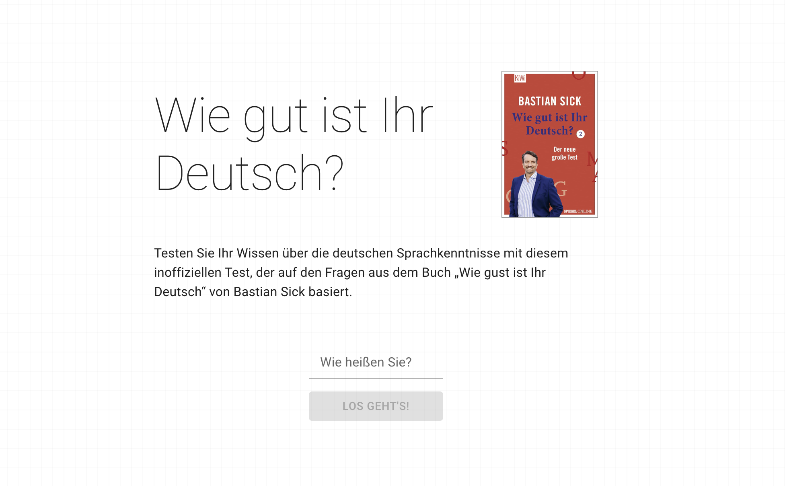

<div align="center">



# Quiz General Knowledge on German Language

Done for educational purposes.

Based on the questions of the German Book _Wie gut ist Ihr Deutsch?_

Deploy [here]()

</div>

## Features

- ⚛️ Cool App Created with React
- 🎨 Clean, Modern UI Using TailwindCSS'
- 🔤 100% written in TypeScript
- 💻 State management with Zustand
- +15 Different Questions (more to be added!)
- 🎁 ...much more

## Getting started

To get started with this project, run

```bash
  git clone https://github.com/manuelsanchezweb/quiz-german-knowledge.git
  nvm use
  npm i
  npm run dev
```
